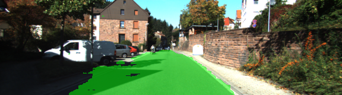

[](http://www.udacity.com/drive)

# The Project
In this project, I label the pixels of a road in images using a Fully Convolutional Network (FCN).

## Architecture
The approach uses the [FCN-8](https://people.eecs.berkeley.edu/~jonlong/long_shelhamer_fcn.pdf) architecture developed at Berkeley. The encoder for FCN-8 is the [VGG16](https://s3-us-west-1.amazonaws.com/udacity-selfdrivingcar/vgg.zip) model pretrained on ImageNet for classification of classes such as differnt animals, vehicles, etc. 
The fully-connected layers of the pretrained VGG16 are replaced by 1-by-1 convolutions. 

The decoder portion of the FCN-8 upsamples the input to the original image size.
Example:
```python
# upsample
layer4a_in1 = tf.layers.conv2d_transpose(layer7a_out, num_classes, 4, 
	                                 strides= (2, 2), 
	                                 padding= 'same', 
	                                 kernel_initializer=tf.random_normal_initializer(stddev=weights_initializer_stddev), 
	                                 kernel_regularizer= tf.contrib.layers.l2_regularizer(weights_regularized_l2),
	                                 name='l2')
```

In order to preserve information on where a specific class is located in the input image, skip conections are added. 
```python
# make sure the shapes are the same!
# 1x1 convolution of vgg layer 4
layer4a_in2 = tf.layers.conv2d(
          vgg_layer4_out, num_classes, 1, 
	  padding= 'same', 
	  kernel_initializer= tf.random_normal_initializer(stddev=weights_initializer_stddev), 
	  kernel_regularizer= tf.contrib.layers.l2_regularizer(weights_regularized_l2),
	  name='l3')
# skip connection (element-wise addition)
layer4a_out = tf.add(layer4a_in1, layer4a_in2)
```

## Training
The FCN-8 network is trained on the [Kitti Road dataset](http://www.cvlibs.net/datasets/kitti/eval_road.php) from [here](http://www.cvlibs.net/download.php?file=data_road.zip). Which proves road images and related labels which describe which part of the road is considered as road (pink) and non-road (red). Additionally, the label describe other roads in black. However, we only use the pink parts as road and all other labels as non-road.

Example of original road:

 
Example of original road:


The hyperparameters used for training are:

* keep_prob: 0.5
* learning_rate: 0.0009
* epochs: 50
* batch_size: 3


## Results
The predictions worked pretty well. However, there are some regions which are incorrectly marked as road or non-road.





## Possible improvements
* Augmentation: We could add further training data by
  - flipping the images and their lables
  - increasing / decreasing the brightness of the images
  - shifting the images and the labels

* Freezing the the weights of the pretrained layers we used in in our FCN-8 network.
 

## Some remarks on setting up the encironment for GPU computing
### First attempt: NVIDIA GeForce GTX 680MX of my iMac
Since the the Udacity classroom highly recommended to use a GPU I thought that I could use the NVIDIA GPU of my iMac.
Thus I set up ubuntu linux, installed the the latest [NVIDIA drivers, cuda 10, cudnn 7 and tensorflow-gpu 1.12](https://medium.com/@taylordenouden/installing-tensorflow-gpu-on-ubuntu-18-04-89a142325138).
After two days of installation I found out that tensorflow-gpu 1.12 requires cuda lavel 3.5 whereas my old GPU only provided 3.0.

### Second attempt: NVIDIA Xavier development kit
I then set up my Nvidia Xavier development kit, that provided much more up to date hardware.
However, it still took about 6 Minutes per epoche.

### Third attempt: Udacity Workspace
The Udacity Workspace provides an Nvidia Tesla K80 GPU, which helped to calculate 50 epochs whith batch size 3 in less than an hour. 


---------------------------------------------------------------------------------

*the description below is Udacity's original README for the project repo*

# Semantic Segmentation
### Introduction
In this project, you'll label the pixels of a road in images using a Fully Convolutional Network (FCN).

### Setup
##### GPU
`main.py` will check to make sure you are using GPU - if you don't have a GPU on your system, you can use AWS or another cloud computing platform.
##### Frameworks and Packages
Make sure you have the following is installed:
 - [Python 3](https://www.python.org/)
 - [TensorFlow](https://www.tensorflow.org/)
 - [NumPy](http://www.numpy.org/)
 - [SciPy](https://www.scipy.org/)
##### Dataset
Download the [Kitti Road dataset](http://www.cvlibs.net/datasets/kitti/eval_road.php) from [here](http://www.cvlibs.net/download.php?file=data_road.zip).  Extract the dataset in the `data` folder.  This will create the folder `data_road` with all the training a test images.

### Start
##### Implement
Implement the code in the `main.py` module indicated by the "TODO" comments.
The comments indicated with "OPTIONAL" tag are not required to complete.
##### Run
Run the following command to run the project:
```
python main.py
```
**Note** If running this in Jupyter Notebook system messages, such as those regarding test status, may appear in the terminal rather than the notebook.

### Submission
1. Ensure you've passed all the unit tests.
2. Ensure you pass all points on [the rubric](https://review.udacity.com/#!/rubrics/989/view).
3. Submit the following in a zip file.
 - `helper.py`
 - `main.py`
 - `project_tests.py`
 - Newest inference images from `runs` folder  (**all images from the most recent run**)
 
 ### Tips
- The link for the frozen `VGG16` model is hardcoded into `helper.py`.  The model can be found [here](https://s3-us-west-1.amazonaws.com/udacity-selfdrivingcar/vgg.zip).
- The model is not vanilla `VGG16`, but a fully convolutional version, which already contains the 1x1 convolutions to replace the fully connected layers. Please see this [post](https://s3-us-west-1.amazonaws.com/udacity-selfdrivingcar/forum_archive/Semantic_Segmentation_advice.pdf) for more information.  A summary of additional points, follow. 
- The original FCN-8s was trained in stages. The authors later uploaded a version that was trained all at once to their GitHub repo.  The version in the GitHub repo has one important difference: The outputs of pooling layers 3 and 4 are scaled before they are fed into the 1x1 convolutions.  As a result, some students have found that the model learns much better with the scaling layers included. The model may not converge substantially faster, but may reach a higher IoU and accuracy. 
- When adding l2-regularization, setting a regularizer in the arguments of the `tf.layers` is not enough. Regularization loss terms must be manually added to your loss function. otherwise regularization is not implemented.
 
### Using GitHub and Creating Effective READMEs
If you are unfamiliar with GitHub , Udacity has a brief [GitHub tutorial](http://blog.udacity.com/2015/06/a-beginners-git-github-tutorial.html) to get you started. Udacity also provides a more detailed free [course on git and GitHub](https://www.udacity.com/course/how-to-use-git-and-github--ud775).

To learn about REAMDE files and Markdown, Udacity provides a free [course on READMEs](https://www.udacity.com/courses/ud777), as well. 

GitHub also provides a [tutorial](https://guides.github.com/features/mastering-markdown/) about creating Markdown files.
